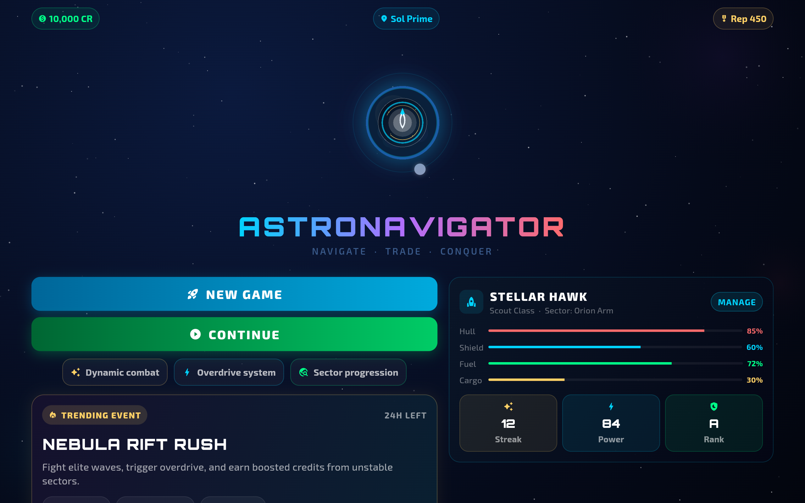
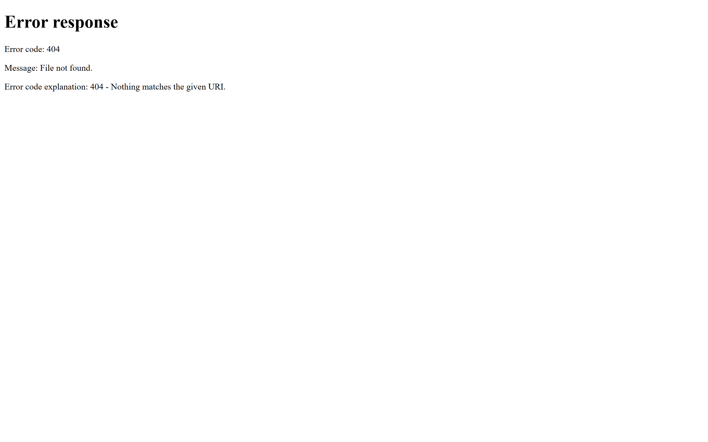

# AstroNavigator

An exciting space exploration game built with Flutter and deployed as a web application.

## 🎮 Play the Game

Visit the live website: [https://innnervision.github.io/AstroNavigator/](https://innnervision.github.io/AstroNavigator/)

## 📸 Screenshots

### Splash Screen

### Main Menu

### Galaxy View

### Hangar

### Codex

### Settings

## 🚀 Features

- Space exploration gameplay
- Multiple galaxies to discover
- Ship customization
- Interactive codex
- Immersive graphics

## 🛠️ Tech Stack

- Flutter
- Dart
- Firebase (for backend services)

## 📝 License

This project is open source and available under the MIT License.
